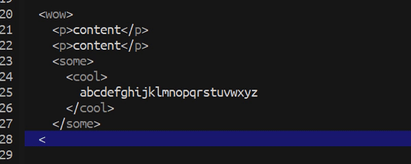

[](https://www.gnu.org/licenses/gpl-3.0)

# auto-close-tag
> Automatically add HTML/XML close tag.

[](https://github.com/jcs-elpa/auto-close-tag/actions/workflows/test.yml)

## Configuration

Set the tag list that would not be auto closed.

```el
(setq auto-close-tag-excluded-tags '("area"
                                     "base"
                                     "br"
                                     "col"
                                     "command"
                                     "embed"
                                     "hr"
                                     "img"
                                     "input"
                                     "keygen"
                                     "link"
                                     "meta"
                                     "param"
                                     "source"
                                     "track"
                                     "wbr")
```

## Usage

Enable for all buffers.

```el
(global-auto-close-tag-mode t)
```

Or you can just enable in specific buffer you want.

```el
(auto-close-tag-mode t)
```

## Screenshot

After typing in the closing bracket of the opening tag, the closing tag
will be inserted automatically. <br/><br/>


To automatically add close tag. <br/><br/>


## Contribute

[](http://makeapullrequest.com)
[](https://github.com/bbatsov/emacs-lisp-style-guide)
[](https://www.paypal.me/jcs090218)
[](https://www.patreon.com/jcs090218)

If you would like to contribute to this project, you may either 
clone and make pull requests to this repository. Or you can 
clone the project and establish your own branch of this tool. 
Any methods are welcome!
